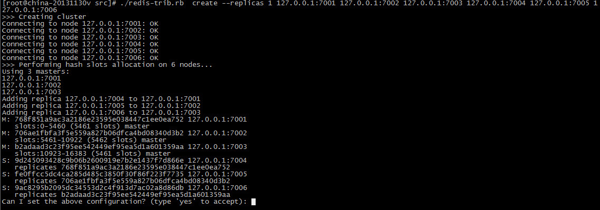
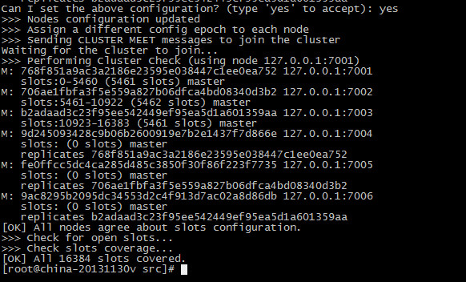

# Redis3.0.1集群安装步骤(包括单机)

**目录：**

[TOC]


## Redis 集群环境说明

### 环境

- OS:Cent OS 7.0
- Ruby:2.2.3
- zlib:1.2.8
- redis:3.0.5


要让集群正常工作至少需要6个主节点，在这里我们要创建6个redis节点，其中三个为主节点，三个为从节点，对应的redis节点的ip和端口对应关系如下
- 127.0.0.1:7001
- 127.0.0.1:7002
- 127.0.0.1:7003
- 127.0.0.1:7004
- 127.0.0.1:7005
- 127.0.0.1:7006


## Redis 集群部署

### 1.下载Redis
官网下载3.0.0版本，之前2.几的版本不支持集群模式;
[下载地址](下载地址：https://github.com/antirez/redis/archive/3.0.0-rc2.tar.gz)

### 2.创建集群需要的目录


```shell
mkdir /usr/local/cluster
cd /usr/local/cluster
mkdir 7001 7002 7003 7004 7005 7006

cd 7001
# 再在每个接口文件夹中创建conf和data文件夹
mkdir conf data
```
**注**：cluster所在目录可以自定义


### 3.上传服务器，解压，编译

```shell
tar -zxvf redis-3.0.5.tar.gz -C /usr/local/cluster
cd /usr/local/cluster/redis-3.0.5
make && make install
```
解压编译完成之后，cluster文件夹中的目录结构如下：


### 4.修改配置文件redis.conf


- port 7000  # redis端口
- daemonize yes # 开启守护进程
- dir /usr/local/cluster/7001/data  #数据文件存放位置（上面在端口文件夹中创建的data文件夹）
- cluster-enabled yes  #启用或停用集群
- cluster-config-file /usr/local/cluster/7001/conf/nodes-7001.conf # 自动生成的集群配置文件
- cluster-node-timeout 5000 # 集群模式下，超时时间
- appendonly yes # 是否开启持久化


修改完redis.conf配置文件中的这些配置项之后把这个配置文件分别拷贝到7000/7001/7002/7003/7004/7005的conf目录下面

```shell
cp /usr/local/cluster/redis-3.0.5/redis.conf /usr/local/cluster/7000/conf
cp /usr/local/cluster/redis-3.0.5/redis.conf /usr/local/cluster/7001/conf
cp /usr/local/cluster/redis-3.0.5/redis.conf /usr/local/cluster/7002/conf
cp /usr/local/cluster/redis-3.0.5/redis.conf /usr/local/cluster/7003/conf
cp /usr/local/cluster/redis-3.0.5/redis.conf /usr/local/cluster/7004/conf
cp /usr/local/cluster/redis-3.0.5/redis.conf /usr/local/cluster/7005/conf
```

**注意**：拷贝完成之后要修改7001/7002/7003/7004/7005目录下面redis.conf文件中的`port`参数和相应的`dir`路径和文件名，分别改为对应的文件夹的名称，`redis-server`命令在src目录下


### 5.分别启动这6个redis实例

```shell
cd /usr/local/cluster/redis-3.0.5/src

redis-server /usr/local/cluster/7001/conf/redis.conf
redis-server /usr/local/cluster/7002/conf/redis.conf
redis-server /usr/local/cluster/7003/conf/redis.conf
redis-server /usr/local/cluster/7004/conf/redis.conf
redis-server /usr/local/cluster/7005/conf/redis.conf
redis-server /usr/local/cluster/7006/conf/redis.conf

```

启动之后使用命令查看redis的启动情况`ps -ef|grep redis`；
如下图显示则说明启动成功:


至此，redis单节点启动成功（单机模式）

### 6.安装集群环境

**安装ruby**：

yum安装：
```
yum install ruby
```
本地安装：

ruby官网：https://www.ruby-lang.org/zh_cn/
```
#tar -zxvf ruby-2.0.0-p247.tar.gz
#cd ruby-2.0.0-p247
#./configure --enable-shared --enable-pthread --prefix=/usr/local/ruby
# make && make install
# 设置环境变量(在最后一行添加ruby的bin目录)：
# vim /etc/profile
export PATH=.:$PATH:/usr/local/ruby/bin
source /etc/profile
ruby -v
```
如果正常输出ruby的版本号，说明安装成功。

**安装rubygems**

yum install rubygems    ---gem在ruby高版本中已经自带了

**执行`gem install redis`**

如果`gem install redis`执行不成功，注：淘宝的ruby为https而不是http
```
$ gem sources --remove https://rubygems.org/
$ gem sources -a https://ruby.taobao.org/
$ gem sources -l
*** CURRENT SOURCES ***

https://ruby.taobao.org
# 请确保只有 ruby.taobao.org$ gem install rails
```
修改完成之后再执行`gem install redis`

如果修改完之后还是无法使用`gem install redis`进行安装，则使用本地的安装方式

注：gem包可以直接在淘宝的源上进行直接下载，eg：https://ruby.taobao.org/gems/redis-3.2.1.gem

本地安装：`gem install -l ./redis-3.2.1.gem`


**如果gem执行不成功,手动下载zlib**：

官网：http://www.zlib.net/
```shell
tar -xvf zlib-1.2.8.tar.gz
cd zlib-1.2.8
./configure --prefix=/usr/local/zlib
make && make install
```

再进行配置一下系统的文件，加载刚才编译安装的zlib生成的库文件

```
vim /etc/ld.so.conf.d/zlib.conf
```

加入如下内容（zlib安装路径）后保存退出
```
/usr/local/zlib/lib
```
进入**ruby**的安装目录(**源码目录**)，路径为zlib编译之后的安装路径

```
cd  /usr/local/ruby/ext/zlib
ruby extconf.rb --with-zlib-dir=/usr/local/zlib
make
make install

```
安装完这些之后，再次执行：`gem install -l ./redis-3.2.1.gem`


### 6：执行redis的创建集群命令创建集群

```shell
cd /usr/local/cluster/redis-3.0.5/src
./redis-trib.rb  create --replicas 1 127.0.0.1:7001 127.0.0.1:7002 127.0.0.1:7003 127.0.0.1:7004 127.0.0.1:7005 127.0.0.1:7006
```


输入`yes`，然后配置完成。



至此redis集群即搭建成功！


### 7：执行命令查看现在的集群中节点的状态
`redis-cli -c -p 7001 cluster nodes`

### 8：使用redis-cli命令进入集群环境
`redis-cli -c -p 7001`

检查集群，我们通过check cluster的一个节点，就知道整个集群的状况，可以看出来谁是主，谁是从
`./redis-trib.rb check 127.0.0.1:7001`

**注：** `replicas` 后面的1代表节点以一主一从的结构创建集群，如果不执行创建集群的命令，每个redis实例将以单机模式运行，所以redis的集群是靠命令来链接实现的。
